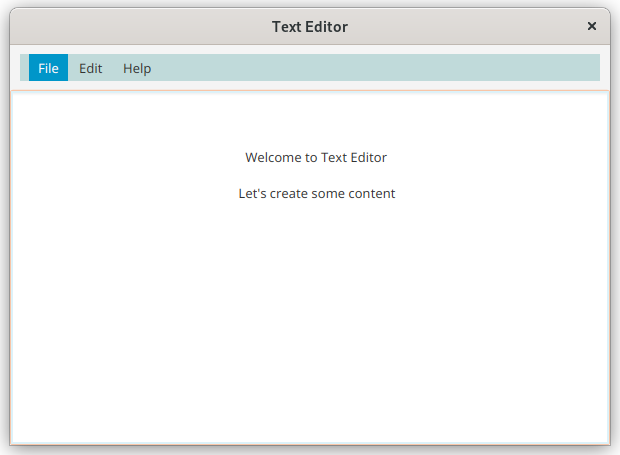
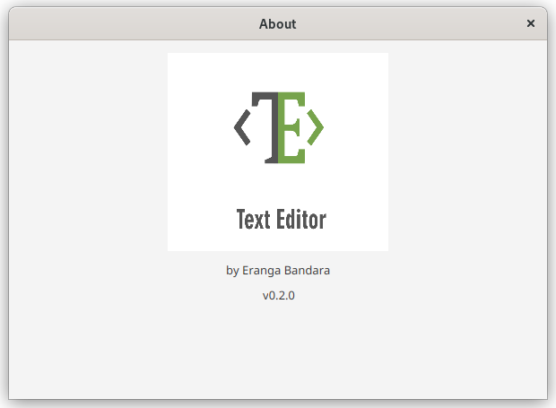
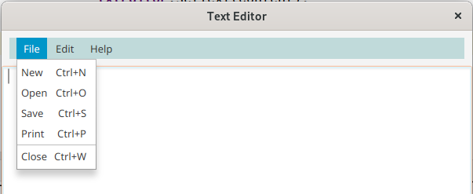
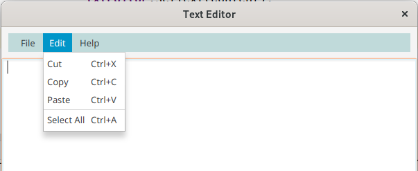

# Text Editor

A simple Java FX text editor

Text Editor can handle plain text files with following features.
1. Create new files
2. Open files
3. Save files
4. Print files

Text Editor can edit plain text files with following featues.
1. Cut
2. Copy
3. Paste
4. Select all

Text Editor can save and open text files in a new file format with the extension of (*.dep9).
However, it also has the ability to read plain text files (*.txt).

### Version
v0.2.0

### License
Copyright &copy; 2022 DEP9. All Rights Reserved.

License under the [MIT License](LICENSE.txt).